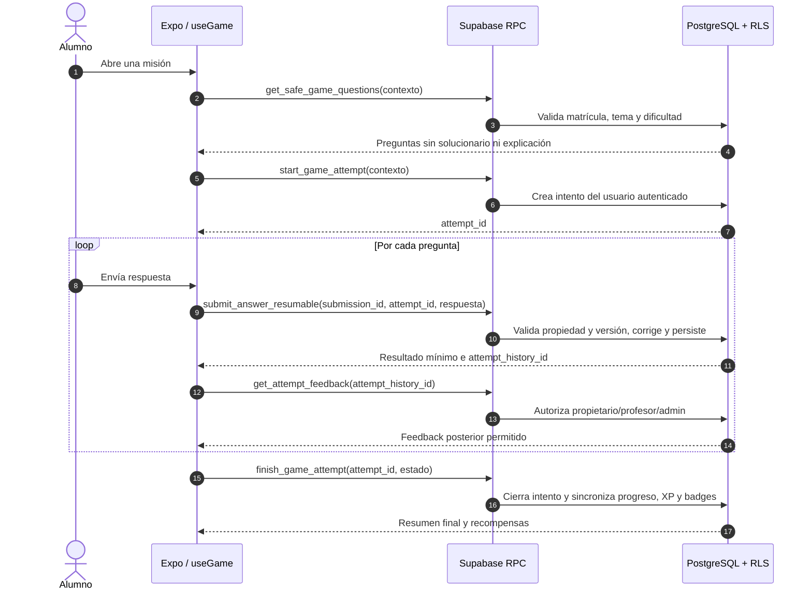

# Diagrama del flujo de juego seguro

## Invariantes

- El cliente no recibe `is_correct` ni el mapa de respuestas antes de enviar una respuesta.
- Cada envío usa un identificador idempotente para soportar reintentos y reconexión.
- La corrección, XP y recompensas se calculan en servidor.
- El feedback completo solo se libera después de existir un intento autorizado.
- `get_game_questions` no se usa desde el cliente autenticado; permanece restringida a operaciones internas de compatibilidad.
